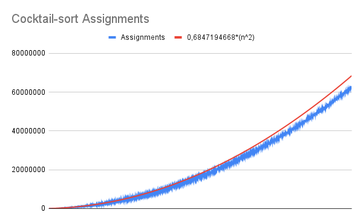

# Analysis of sorts algorithm time & operations complexity  

## Sort algorithms: 
* <a href=#shell-sort>Shell sort</a> 
* <a href=#cocktail-sort>Cocktail sort</a> 
* <a href=#merge-sort>Merge sort</a>  

## Project contents
1- <a href=#developed-program>Program</a> that allow measure data from sort algorithms

    * Measure each sort algorithm.  
    * Measure the data related with the complexity of sort algorithms.  

2- <a href=#study-of-the-generated-data>Filtered, analyzed and studied</a> the measured data.  
3- <a href=#conclusions>Extracted conclusions</a>  about the complexity of the sort algorithms.


### Data that will be studied
    1- Time that takes to sort an array.
    2- Operations that involved the array.
        * Assignments.
        * Comparisons.

### Considerations

    * n = size of an array.
    * Data was generated by the developed program
    * Arrays used in the measures are unordered due to the fact that are filled with pseudo random numbers.
    * The study and analysis of the measured data has been done with google spreadsheet similar to excel.
---

# Developed program
## How to compile and run the project without using an IDE:
Compile the project into a separate output directory  *(out/)* 
From the root path of the project 

1- Compile the program code of the src.  
```
javac -d out -classpath .:src:lib/junit-4.13.2.jar:lib/hamcrest-core-1.3.jar -sourcepath src $(find . -name "*.java")  
```

## How to run the program
From the root of the project  
```  
java -cp .:out:src LauncherMeasureSortAlgorithms  
```

*Disclaimer:* Commands are writed as unix format, if there is any error check way should be in you OS.  

## Quick compile and run all in the same directory
From the path of the project  
Using java make, but the test will not be compiled!! so you will have to compile it later. 

```  
javac -cp .:src LauncherMeasureSortAlgorithms.java 
java -cp .:src LauncherMeasureSortAlgorithms  
```

## How to run unit tests
1- From the root of the project with the compiled project 
```
java -cp .:src:out:lib/junit-4.13.2.jar:lib/hamcrest-core-1.3.jar org.junit.runner.JUnitCore test.SortAlgorithmsTests  
```


#### Launcher
The [Launcher](src/LauncherMeasureSortAlgorithms.java), should be used to take measures of the [Sorts algorithms](src/algorithm/SortAlgorithms.java). 
For every size is generated a new *"random array"*, and each sort algorithm uses a copy of these one.   
It uses arrays filled with random numbers between [0-*maxRandomNumber*], **maxRandomNumber** is a static variable defined with in the Laucher class.  
The random arrays are generated with use of the class [RandomIntArray](src/data/RandomIntArray.java).  
Generated files will depend of the java project classpath used and the provided path for the file.    


#### Unit Test JUnit 4
[Unit tests](src/test), test the different sort algorithms in the [src/algorithm/SortAlgorithms](src/algorithm/SortAlgorithms.java) with some edge cases.

    * Sort normal array.
    * Sort a empty array.
    * Sort a already sorted array.
    * Sort a array with duplicates.
Using Junit4 and hamcrest-core libreries.

#### Project Strucuture
    1- Class analyzer, (LauncherMeasureSortAlgorithms).
    2- Class with the sort algorithm, (algorithm.SortAlgorithms).
    2.1- Class with type of algorithms, (algorithm.typeAlgorithm).
    3- Class random array generator, (data.RandomIntArray).
    4- Class with the basic data to anlyze time complexity, (data.Data).
    5- Class contains the different data, (data.DataSet).
    6- Class to write data as csv files, (csv.CsvWriterSimple).
    7- Package test is for unit tests for the sort methods.
        * (test/SortAlgorithmsTest) is the class with the tests for the use the method in ArraySorter.
    8- Directory (data/) contains the raw measures and the analyzed ones & some graphs.


# Study of the generated data

## Data analyzed
File [raw-measures.csv](data/raw-measures.csv)

    * Type of the algorithm.
    * Time to sort the algorithm.
    * Operations need to sort (Comparations &  Assigments).
    * Size of the array.

## How data was obtained & analyzed: (data/filtered-data.xlsx)
File [filtered-data.xlsx](data/filtered-data.xlsx)

    1- Measure the data using the program developed -> data/raw-measures.csv
    2- Using google sheets, filter the data of each type of algorithm.
    3- Remove some first meditions due to they are not consistant with the data
        * Meditions with an array size less than 245.
    4- Find the complexity of each algorithm for each type of measure by bounding the data.
    5- Find the constant that muliply the complexity
        1- K = operation/complexity.
        2- Do it for all the data
        3- Get the average k for each one of the types of measures for each type of algorithm.
        4- Example of Cocktail-sort K(time)-> K = TIME/(n^2)
    6- Elaborate the complexity formula for every one.


# Conclusions
## Shell sort
    * Complexity depends of the size of the gaps.
    * In this case is *(h = 3 * h + 1;)* .
    * Worst-case time complexity should be  **O(n^(3/2))**.
    * Best-case time complexity should be **O(n^2)**.
    * Average case time complexity is in the interval **[O(n^2), O(n^(3/2))]**.
### Complexity formula for time = **17,4413747094157(n^(6/5))**  
  
### Complexity formula for comparisons = **3,751513396(n^(6/5))**  
  
### Complexity formula for assignments = **4,948071144(n^(6/5))**  
  


## Cocktail sort
    * This algorithm is also know as Bidirectional Bubbel Sort.
    * Worst-case time complexity is **O(n^2)**.
    * Best-case time complexity happends when the input is already or nearly sorted **O(n)**.
    * Average-case time complexity is **O(n^2)**.
### Complexity formula for time = **1,129089349(n^2)**  
  
### Complexity formula for comparisons = **0,3770798664(n^2)**  
  
### Complexity formula for assignments = **0,6847194668(n^2)**  
  

## Merge sort
    * Worst-case time complexity is **O(n log(n))**.
    * Best-case time complexity is also **O(n log(n))**.
    * Average-case time complexity is also **O(n log(n))**.  
### Complexity formula for time = **37,35874024(n log(n))**  
  
### Complexity formula for comparisons = **1,461899217(n log(n))**  
  
### Complexity formula for assignments = **6,694346692(n log(n))**  
  


